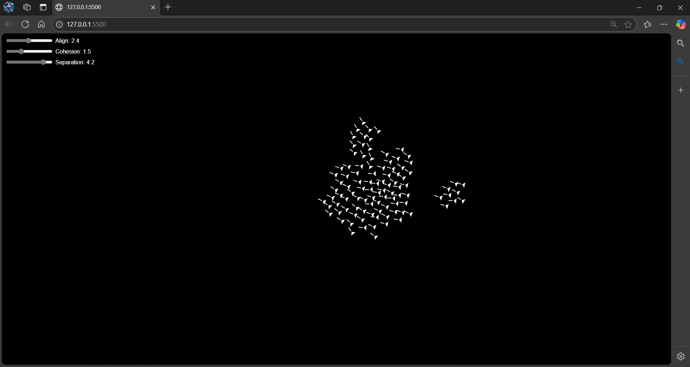

Dưới đây là phiên bản hoàn chỉnh với phần hiển thị ảnh kết quả và link demo:

---

# Flocking Algorithm Robot System (Based on YouTube Reference)

## Introduction
This robot flocking system utilizes the **flocking algorithm** to simulate the movement of robots in a group. It uses principles such as **Separation**, **Alignment**, and **Cohesion** to create natural group behavior. The system runs in a web browser using **JavaScript**, **CSS**, and **HTML**. For more in-depth understanding, this project is based on concepts from the video:

### Reference
**[1]** M. D. Bogue, "Flocking Algorithm Tutorial for Robots," *YouTube*, Apr. 19, 2020. [Online]. Available: https://www.youtube.com/watch?v=mhjuuHl6qHM&t=2119s. [Accessed: Dec. 29, 2024].

## System Structure

### 1. **User Interface (UI)**
The interface consists of the following key elements:
- **Canvas**: Used to draw the moving robots.
- **Controls**: Allows the user to change parameters like robot speed and behavior.
  
### 2. **Flocking Algorithm**
The algorithm models the behavior of robots based on three key principles:
1. **Separation**: Prevents robots from colliding by moving away from others when too close.
2. **Alignment**: Robots align their movement direction with nearby robots.
3. **Cohesion**: Robots move toward the center of the group to stay close together.

### 3. **Controlling the Robots**
- Each robot is visually represented on the screen (as a circle or an image).
- JavaScript dynamically updates the position of each robot using the flocking algorithm.
- **CSS** is used to style the UI, including effects for robots as they move.

## How to Implement

1. **Clone or Download the Source Code**:
   Clone the repository from GitHub:
   ```bash
   git clone https://github.com/longnp54/flocking_algorithm.git
   cd flocking_algorithm
   ```

2. **Run the System**:
   - Open `index.html` in any web browser to view and interact with the system.

## Demo

You can view the project in action through the **[video demo](https://drive.google.com/drive/folders/1B85deOdz3ShP1tNGiMeTakf3MvgRbyU7?usp=drive_link)**.

## Results

### Screenshot of the Simulation

Below is a screenshot showcasing the simulation in action, where robots adjust their movement based on the flocking algorithm principles:



---

Feel free to explore the code, experiment with parameters, or integrate the flocking algorithm into your own robotic projects!